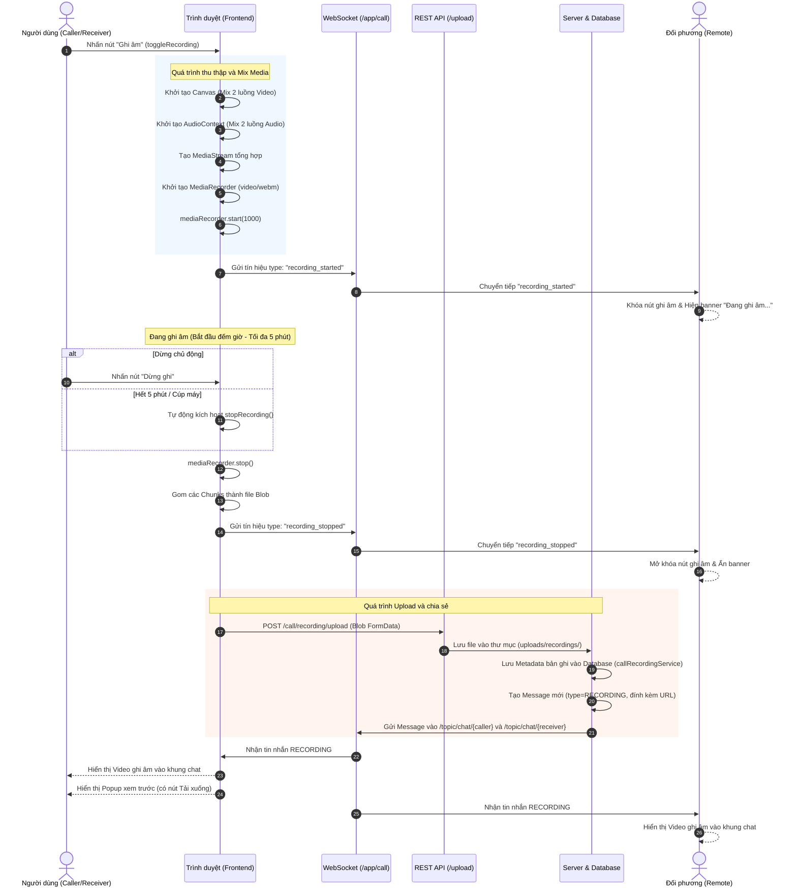

# Luồng hoạt động của Gọi điện (Video Call) và Ghi âm (Recording)

Hệ thống sử dụng **WebRTC** để truyền luồng Video/Audio theo thời gian thực (Peer-to-Peer) và **WebSocket (STOMP)** để truyền các tín hiệu báo gọi (Signaling).

## 1. Luồng hoạt động của Gọi điện Video

### 1.1. Khởi tạo cuộc gọi (Người gọi - Caller)
- Người dùng nhấn vào biểu tượng Gọi Video trong khung chat.
- Gọi hàm `startVideoCall(friendId)`.
- Hệ thống xin quyền truy cập Camera và Microphone qua `navigator.mediaDevices.getUserMedia()`.
- Giao diện cuộc gọi (`callModal`) hiện lên, hiển thị video của chính mình.
- Khởi tạo `RTCPeerConnection` (đối tượng chính của WebRTC) và thêm các luồng (track) video/audio vào connection.
- Tạo một **Offer (SDP)** mô tả cấu hình media của mình, lưu vào cấu hình nội bộ (`setLocalDescription`) và gửi `Offer` này qua WebSocket (`/app/call`) cho người nhận với loại tín hiệu là `offer`.

### 1.2. Nhận cuộc gọi (Người nhận - Receiver)
- Người nhận được tín hiệu `offer` thông qua kênh WebSocket (`/topic/call/{userId}`).
- Modal thông báo cuộc gọi đến xuất hiện (`showIncomingCallModal`).
- **Nếu từ chối:** Gửi lại tín hiệu `reject` qua WebSocket. Người gọi nhận được sẽ tự động tắt giao diện gọi.
- **Nếu chấp nhận (`acceptCall`):**
  - Xin quyền Camera và Microphone của người nhận.
  - Khởi tạo `RTCPeerConnection`, nạp cấu hình **Offer** vừa nhận vào làm `RemoteDescription`.
  - Tạo ra một **Answer (SDP)**, lưu làm `LocalDescription` và gửi lại cho người gọi qua WebSocket với tín hiệu `answer`.

### 1.3. Kết nối P2P và truyền dữ liệu
- Người gọi nhận được tín hiệu `answer`, nạp vào làm `RemoteDescription`.
- Song song với việc gửi Offer/Answer, cả 2 bên liên tục thu thập và trao đổi các **ICE Candidates** (thông tin mạng, địa chỉ IP để kết nối trực tiếp với nhau) qua WebSocket (`type: ice`).
- Khi kết nối P2P thành công, sự kiện `ontrack` sẽ được kích hoạt. Luồng video/audio của đối phương sẽ được gán vào thẻ `<video id="remoteVideo">` để hiển thị trên màn hình.

### 1.4. Kết thúc cuộc gọi
- Một trong hai bên nhấn nút Cúp máy (`endCall()`).
- Nếu đang trong quá trình ghi âm, hệ thống sẽ tự động dừng ghi.
- Đóng kết nối WebRTC (`peerConnection.close()`), tắt các track Camera/Micro.
- Gửi tín hiệu `hangup` qua WebSocket cho bên kia để họ cũng đóng kết nối tương tự. 
- Ẩn giao diện cuộc gọi.

---

## 2. Luồng hoạt động của Ghi âm cuộc gọi (Recording)

Tính năng ghi âm chạy ở Client-side (Frontend) và sẽ mix (trộn) cả video và audio của 2 bên thành một luồng duy nhất để quay lại.

### 2.1. Bắt đầu ghi âm (`startRecording`)
- Khi người dùng nhấn nút Ghi âm, hệ thống dùng thẻ `<canvas>` để vẽ đè 2 khung hình video (của mình và của đối phương) cạnh nhau.
- Dùng `AudioContext` để trộn (mix) 2 luồng âm thanh của cả 2 bên lại với nhau.
- Gộp luồng video từ canvas và âm thanh đã trộn thành một `MediaStream` chung.
- Khởi tạo `MediaRecorder` để quay lại luồng stream tổng hợp này dưới định dạng `video/webm`.
- Gửi tín hiệu `recording_started` cho đối phương biết để hiển thị thông báo "Cuộc gọi đang được ghi âm" và vô hiệu hóa nút ghi âm của họ (để tránh 2 người cùng ghi).
- Bắt đầu đồng hồ đếm thời gian (Tối đa 5 phút).

### 2.2. Dừng ghi âm (`stopRecording`)
- Khi người dùng chủ động dừng, hoặc vượt quá 5 phút, hoặc kết thúc cuộc gọi.
- `MediaRecorder` dừng quay. Các mảnh dữ liệu (chunks) video thu thập được trong quá trình ghi sẽ được gộp lại thành một `Blob` (một file video hoàn chỉnh trên RAM của trình duyệt).
- Gửi tín hiệu `recording_stopped` cho bên kia để ẩn thông báo.
- Chuyển sang bước Upload.

### 2.3. Upload và chia sẻ bản ghi (`uploadRecording`)
- Đóng gói file video (`Blob`) cùng với thông tin người nhận, thời lượng video vào `FormData`.
- Gửi API POST đến `/call/recording/upload`.
- Ở phía **Server (CallController)**:
  - Nhận file, kiểm tra dung lượng (tối đa 200MB).
  - Lưu file video vào thư mục `uploads/recordings/`.
  - Lưu bản ghi vào cơ sở dữ liệu (`callRecordingService`).
  - **Tạo ra một Message mới** với `MessageType = RECORDING` chứa link video ghi âm.
  - Dùng WebSocket gửi tin nhắn đó vào kênh chat (`/topic/chat/...`) của cả 2 người.
- Ở phía **Client**:
  - Giao diện chat của cả 2 bên sẽ lập tức hiện ra đoạn chat chứa video ghi âm. Cả 2 đều có thể xem lại hoặc tải xuống.
  - Hiển thị Popup cho người vừa ghi âm xem lại nhanh (`showRecordingResult`).
