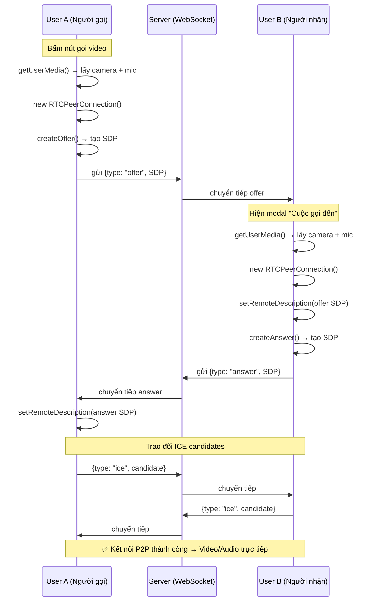
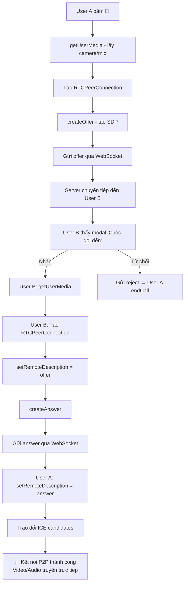

# Giải thích chi tiết Video Call trong dự án

## Tổng quan kiến trúc

Video Call sử dụng **WebRTC** (peer-to-peer) để truyền video/audio trực tiếp giữa 2 trình duyệt, kết hợp **WebSocket (STOMP)** làm kênh tín hiệu (signaling) để 2 bên trao đổi thông tin kết nối.



---

## Các thành phần

### 1. Backend

#### [CallMessage.java](file:///d:/Learning/Khoa-Luan-Tot-Nghiep/socialnetwork/src/main/java/vn/hactanco/socialnetwork/websocket/CallMessage.java)

DTO đại diện cho một message trong luồng gọi video:

| Field | Mô tả |
|-------|-------|
| `type` | Loại tin nhắn: `offer`, `answer`, `ice`, `reject`, `cancel` |
| `from` | ID người gửi |
| `to` | ID người nhận |
| `data` | Nội dung: SDP description hoặc ICE candidate (dạng JSON string) |
| `fromName` | Tên người gọi (hiển thị trên modal incoming call) |

#### [CallController.java](file:///d:/Learning/Khoa-Luan-Tot-Nghiep/socialnetwork/src/main/java/vn/hactanco/socialnetwork/controller/CallController.java)

```java
@MessageMapping("/call")
public void handle(CallMessage msg) {
    messagingTemplate.convertAndSend("/topic/call/" + msg.getTo(), msg);
}
```

> [!IMPORTANT]
> Controller **chỉ làm 1 việc duy nhất**: nhận message từ `@MessageMapping("/call")` rồi chuyển tiếp đến `/topic/call/{userId}` của người nhận. Server **không xử lý logic gì**, chỉ là "bưu điện" trung gian. Toàn bộ logic WebRTC nằm ở frontend.

---

### 2. Frontend — Luồng chi tiết

#### Biến toàn cục ([chat.js](file:///d:/Learning/Khoa-Luan-Tot-Nghiep/socialnetwork/src/main/resources/static/assets/js/chat.js) dòng 1-12)

```js
let localStream = null;        // MediaStream từ camera/mic của mình
let peerConnection = null;     // RTCPeerConnection — kết nối P2P
let pendingCandidates = [];    // ICE candidates nhận được trước khi có remoteDescription
let currentCallRemoteId = null; // ID người đang gọi

const config = {
    iceServers: [
        { urls: "stun:stun.l.google.com:19302" }  // STUN server miễn phí của Google
    ]
};
```

> [!NOTE]
> **STUN server** giúp mỗi bên tìm ra IP public của mình (vì thường nằm sau NAT/router). Google cung cấp STUN miễn phí. Nếu cả 2 bên đều nằm sau NAT phức tạp, cần thêm **TURN server** (relay) — hiện tại code chưa có.

---

#### Bước 1: Người gọi — `startVideoCall(friendId)` (dòng 299-350)

```
Bấm nút 🎥 trên chatbox → gọi startVideoCall(friendId)
```

Thứ tự thực hiện:

1. **Lấy camera + mic**
   ```js
   localStream = await navigator.mediaDevices.getUserMedia({ video: true, audio: true });
   ```
   Trình duyệt sẽ hỏi quyền truy cập camera/mic.

2. **Hiện giao diện gọi**
   ```js
   showCallUI(localStream);
   // → Hiện #callModal, set localVideo.srcObject = stream
   ```

3. **Tạo PeerConnection**
   ```js
   peerConnection = new RTCPeerConnection(config);
   ```
   Đây là đối tượng core của WebRTC, quản lý toàn bộ kết nối P2P.

4. **Thêm track vào connection**
   ```js
   localStream.getTracks().forEach(track => peerConnection.addTrack(track, localStream));
   ```
   Gắn video track + audio track vào connection → khi kết nối thành công, bên kia sẽ nhận được.

5. **Lắng nghe track từ bên kia**
   ```js
   peerConnection.ontrack = e => {
       document.getElementById("remoteVideo").srcObject = e.streams[0];
   };
   ```
   Khi nhận được video/audio từ bên kia → hiển thị vào `<video id="remoteVideo">`.

6. **Lắng nghe ICE candidate**
   ```js
   peerConnection.onicecandidate = e => {
       if (e.candidate) {
           chatStompClient.send("/app/call", {}, JSON.stringify({
               type: "ice", from: currentUserId, to: friendId,
               data: JSON.stringify(e.candidate)
           }));
       }
   };
   ```
   ICE candidate = thông tin đường mạng mà 2 bên dùng để kết nối trực tiếp. Mỗi khi tìm được 1 đường mạng mới → gửi qua WebSocket cho bên kia.

7. **Tạo và gửi Offer**
   ```js
   const offer = await peerConnection.createOffer();
   await peerConnection.setLocalDescription(offer);  // Lưu vào local
   
   chatStompClient.send("/app/call", {}, JSON.stringify({
       type: "offer", from: currentUserId, fromName: currentUserName,
       to: friendId, data: JSON.stringify(offer)
   }));
   ```
   **Offer** chứa **SDP (Session Description Protocol)** — mô tả khả năng media của mình (codec video/audio, bandwidth...).

8. **Timeout nếu không có phản hồi** (5 giây)
   ```js
   window.callTimeout = setTimeout(() => {
       if (peerConnection && !peerConnection.remoteDescription) {
           chatStompClient.send("/app/call", {}, JSON.stringify({
               type: "cancel", from: currentUserId, to: friendId
           }));
           alert("Không có phản hồi từ người nhận");
           endCall();
       }
   }, 5000);
   ```

---

#### Bước 2: Người nhận — WebSocket listener (dòng 19-69)

Khi User B nhận được message trên `/topic/call/{userId}`:

##### Nhận `offer`:
```js
if (data.type === "offer") {
    if (data.to != currentUserId) return; // chỉ xử lý nếu mình là người nhận
    handleIncomingCall(data);  // → hiện modal "Cuộc gọi đến"
}
```

##### `showIncomingCallModal(data)` (dòng 359-421)

Tạo modal popup hiển thị:
- Tên người gọi (`data.fromName`)
- Nút **Nhận** (xanh) → gọi `acceptCall(data)`
- Nút **Từ chối** (đỏ) → gửi `{type: "reject"}` qua WebSocket

##### `acceptCall(data)` (dòng 424-465)

Tương tự `startVideoCall` nhưng là phía nhận:

1. Lấy camera + mic
2. Tạo PeerConnection  
3. Thêm tracks + lắng nghe ontrack, onicecandidate
4. **Set remote description = offer từ người gọi**
   ```js
   await peerConnection.setRemoteDescription(JSON.parse(data.data));
   ```
5. **Thêm ICE candidates đã nhận trước đó** (nếu có)
   ```js
   pendingCandidates.forEach(c => peerConnection.addIceCandidate(c));
   ```
6. **Tạo Answer và gửi lại**
   ```js
   const answer = await peerConnection.createAnswer();
   await peerConnection.setLocalDescription(answer);
   chatStompClient.send("/app/call", {}, JSON.stringify({
       type: "answer", from: currentUserId, to: data.from,
       data: JSON.stringify(answer)
   }));
   ```

---

#### Bước 3: Người gọi nhận Answer (dòng 31-40)

```js
if (data.type === "answer") {
    if (data.to != currentUserId) return;
    if (!peerConnection) return;
    
    await peerConnection.setRemoteDescription(JSON.parse(data.data));
    
    // Thêm các ICE candidate đã chờ sẵn
    pendingCandidates.forEach(c => peerConnection.addIceCandidate(c));
    pendingCandidates = [];
}
```

Sau bước này, cả 2 bên đã có `localDescription` + `remoteDescription` → WebRTC bắt đầu thương lượng kết nối P2P.

---

#### Bước 4: Trao đổi ICE candidates (dòng 43-53)

```js
if (data.type === "ice") {
    if (data.to != currentUserId) return;
    
    const candidate = JSON.parse(data.data);
    
    if (peerConnection && peerConnection.remoteDescription) {
        await peerConnection.addIceCandidate(candidate);
    } else {
        pendingCandidates.push(candidate);  // Chờ đến khi có remoteDescription
    }
}
```

> [!TIP]
> **Tại sao cần `pendingCandidates`?** ICE candidates có thể đến **trước khi** `setRemoteDescription()` hoàn tất. Nếu gọi `addIceCandidate()` khi chưa có remoteDescription → lỗi. Nên lưu tạm và add sau.

---

#### Bước 5: Kết thúc cuộc gọi — `endCall()` (dòng 470-482)

```js
function endCall() {
    if (peerConnection) {
        peerConnection.close();   // Đóng kết nối P2P
        peerConnection = null;
    }
    if (localStream) {
        localStream.getTracks().forEach(t => t.stop()); // Tắt camera & mic
        localStream = null;
    }
    document.getElementById("callModal").style.display = "none";
}
```

---

#### Từ chối / Hủy cuộc gọi

| Type | Khi nào | Ai gửi | Ai nhận |
|------|---------|--------|---------|
| `reject` | Bấm nút "Từ chối" | Người nhận | Người gọi → `alert("Bị từ chối")` + `endCall()` |
| `cancel` | Timeout 5s không có phản hồi | Người gọi | Người nhận → xóa modal incoming call |

---

### 3. UI — [callModal](file:///d:/Learning/Khoa-Luan-Tot-Nghiep/socialnetwork/src/main/resources/templates/friendships/friendship.html#L645-L679)

```html
<div id="callModal" style="display:none; position:fixed; inset:0; background:black; z-index:99999;">
    <!-- Video nhỏ ở góc (camera của mình) -->
    <video id="localVideo" autoplay muted style="position:absolute; bottom:20px; right:20px; width:200px;"></video>
    
    <!-- Video lớn full màn hình (camera bên kia) -->
    <video id="remoteVideo" autoplay style="width:100%; height:100%; object-fit:cover;"></video>
    
    <!-- Nút kết thúc -->
    <button onclick="endCall()" style="...background:red...">End</button>
</div>
```

---

## Tóm tắt luồng bằng sơ đồ



## Khái niệm cốt lõi

| Thuật ngữ | Giải thích |
|-----------|-----------|
| **WebRTC** | API trình duyệt cho phép truyền video/audio/data trực tiếp giữa 2 trình duyệt (P2P), không cần đi qua server |
| **Signaling** | Quá trình 2 bên trao đổi thông tin ban đầu (SDP, ICE) **qua server** để thiết lập kết nối P2P. Trong code bạn dùng WebSocket (STOMP) |
| **SDP** | Session Description Protocol — mô tả media capabilities: codec, resolution, bandwidth... |
| **Offer/Answer** | Mô hình thương lượng: bên gọi tạo Offer, bên nhận tạo Answer. Cả 2 chứa SDP |
| **ICE** | Interactive Connectivity Establishment — framework tìm đường kết nối tốt nhất giữa 2 peer |
| **ICE Candidate** | Một "đường mạng" khả dĩ (IP:port). Mỗi peer tìm ra nhiều candidates → gửi cho bên kia → thử kết nối |
| **STUN** | Server giúp peer biết IP public của mình (vì thường nằm sau NAT). Code dùng `stun.l.google.com:19302` |
| **TURN** | Server relay — dùng khi P2P không thể kết nối trực tiếp. Code hiện **chưa có** TURN server |
